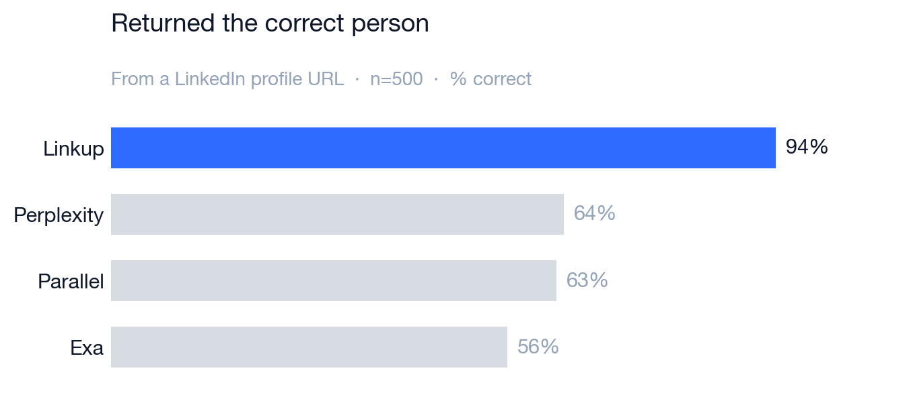
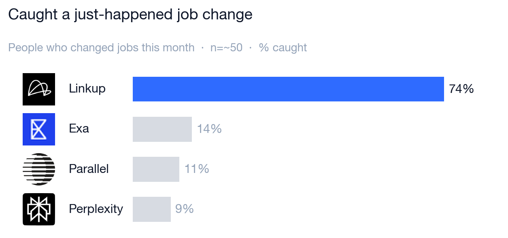
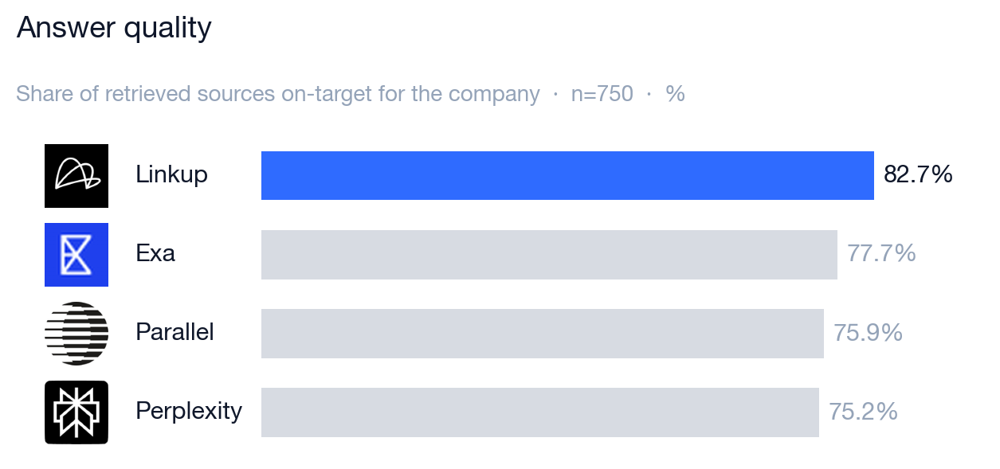
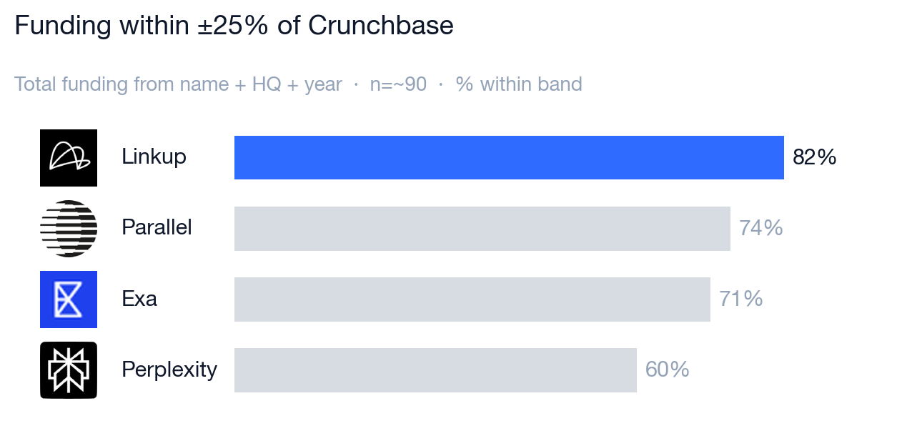

# Linkup GTM Benchmarks

Public, reproducible benchmarks of how well web-search APIs handle real production
GTM work. We compare the major players on the market — **Linkup, Exa, Perplexity,
and Parallel** — across the two use cases at the core of every modern GTM motion:

- **People** — pull correct, current, and rich information about a person from the
  open web: the data behind enrichment, lead scoring, and signal detection.
- **Company** — research a company end to end: the firmographics and signal that
  drive account scoring, prioritization, and outbound.

Each benchmark ships its dataset, the exact queries, the scoring code, and the
results, so every number here can be re-run and re-checked.

**Why this exists.** A search API is increasingly the retrieval layer behind CRM
enrichment, pre-call research, lead scoring, signal detection, and many other
AI-native workflows. The usual benchmarks for these APIs measure generic QA; these
measure the GTM jobs: given a person, return *that* person; given a company, return
information a rep can act on.

---

## Linkup across GTM tasks

Two benchmarks, scored across all four engines. Higher is better unless noted.

### People

| Signal         | What it measures                                                                       | Linkup   | Exa  | Perplexity | Parallel |
| -------------- | -------------------------------------------------------------------------------------- | -------- | ---- | ---------- | -------- |
| **Enrichment** | Returned the **correct and complete information about a person** from LinkedIn (n=500) | **94%**  | 56%  | 64%        | 63%      |
| **Richness**   | Real-time, current activity about a person from across the web, 0–100 (n=100)          | **64.8** | 55.8 | 53.1       | 59.8     |
| **Freshness**  | Caught a **just-happened signal** (example tracked: job change) (n=~50)                  | **74%**  | 14%  | 9%         | 11%      |

### Company

| Signal               | What it measures                                            | Linkup    | Exa   | Perplexity | Parallel |
| -------------------- | ---------------------------------------------------------- | --------- | ----- | ---------- | -------- |
| **Answer quality**   | Share of retrieved sources **on-target** for the company (n=150) | **82.7%** | 77.7% | 75.2%      | 75.9%    |
| **Funding accuracy** | Total funding within **±25%** of Crunchbase (n=~90)         | **82%**   | 71%   | 60%        | 74%      |

---

## People

Three signals that cover the people-data lifecycle:

1. Getting the record right
2. Turning it into something useful
3. Keeping it current

### Signal 1 — Enrichment success rate *(completeness + correctness, n=500)*

We hand each API a LinkedIn profile URL and ask for the full profile via its native
structured-output endpoint. Two deterministic checks against an independent
ground-truth DB: *how much came back*, and *is it the right person?*

| Engine     | Fields filled (completeness /100) | Correct person (%) | Wrong person / namesake (of 500) |
| ---------- | --------------------------------- | ------------------ | -------------------------------- |
| **Linkup** | **96.5**                          | **94%**            | **12**                           |
| Perplexity | 73.7                              | 64%                | 122                              |
| Exa        | 71.9                              | 56%                | 191                              |
| Parallel   | 60.5                              | 63%                | 69                               |



Completeness and correctness are different questions: an engine can fill the *name*
box confidently while attaching the wrong human's company. Because correctness is
checked against an independent DB, the gap measures the thing downstream automation
depends on — whether the record points at the right account before a rep ever sees it.

**Where this matters in GTM:** CRM enrichment and data hygiene, lead routing and
scoring, identity resolution and dedupe, and clean list/TAM building — all of which
depend on a record that's both filled *and* pointed at the right person.

### Signal 2 — Richness of content *(e.g. pre-meeting brief quality, n=100)*

A different task from extraction: each engine's raw web results are synthesized into
a short sales brief (notes + conversation questions), then scored by an Opus-4.8
judge on freshness + specificity + actionability.

| Engine     | Brief score (overall /100) | Freshness | Specificity | Actionability | Best brief (of 100) |
| ---------- | -------------------------- | --------- | ----------- | ------------- | ------------------- |
| **Linkup** | **64.8**                   | **58.6**  | 69.4        | **68.2**      | **51**              |
| Parallel   | 59.8                       | 45.9      | 70.1        | 64.9          | 26                  |
| Exa        | 55.8                       | 43.9      | 66.0        | 59.9          | 16                  |
| Perplexity | 53.1                       | 42.6      | 59.7        | 58.1          | 6                   |


**Where this matters in GTM:** account research before a call. Freshness is the
differentiator — surfacing a post from last week or a just-announced round preps a
rep better than a 2019 job title.

### Signal 3 — Freshness of people content *(job-change detection, n=~50)*

We took a subset of people who changed jobs **this month** and asked each engine for
their current employer — does it report the **new** company or the **stale** old one?

| Engine     | Caught the move (fresh %) | Reported stale employer | Wrong person | No answer |
| ---------- | ------------------------- | ----------------------- | ------------ | --------- |
| **Linkup** | **74%**                   | 7                       | 4            | 4         |
| Exa        | 14%                       | 32                      | 11           | 6         |
| Parallel   | 11%                       | 30                      | 11           | 10        |
| Perplexity | 9%                        | 17                      | 7            | 28        |



**Where this matters in GTM:** job-change signals are among the highest-value sales
triggers — a champion who just moved may buy again — but only if they're fresh. The
common failure mode is *stale*: the right person, reported at their previous company.

---

## Company

Firmographics and research that drive account scoring, prioritization, and outbound.
Two signals are live; more are in progress.

### Signal 1 — B2B company research *(n=150, 5 sections)*

For 150 real companies, each engine runs five sections of GTM research. The method
is held identical across engines so the result reflects *retrieval*, not the writer:

1. **Agentic retrieval** — for each section the engine runs the section's searches
   (and scrapes the company page where supported) and returns **raw sources**.
2. **Shared synthesis** (`claude-sonnet-4-6`) — the same prompt turns each engine's
   raw results into a structured list, grounded *only* in what that engine returned.
3. **Judge** (`claude-opus-4-8`) — scores each section against the company's
   **verified identity** (domain, HQ, founded, funding, investors) for right-company,
   on-target sources, and whether it answered the ask.

The five sections — what each set of queries goes after, and why it's GTM signal:

| Section             | What the queries target                                   | Why it matters                                            |
| ------------------- | --------------------------------------------------------- | --------------------------------------------------------- |
| **Offering**        | homepage + *"what does {company} do / product"*           | the core pitch: what they sell and to whom                |
| **Pain → solution** | *features / benefits* + *pain point / problem / solution* | maps buyer problems to the product angle a rep leads with |
| **Case studies**    | *case study / success story / ROI / metrics*              | proof points: customer + key result                       |
| **Customers**       | *customer / client / "trusted by" / partnership*          | named logos and partners for account mapping              |
| **CTAs**            | site-scoped *book a demo / pricing / sign up*             | the buying motion and conversion signals                  |

| Engine     | Actionable signals / co. | Repeated | Answer quality (on-target) | Answered the ask | Right company | Worst-case (P10) |
| ---------- | ------------------------ | -------- | -------------------------- | ---------------- | ------------- | ---------------- |
| **Linkup** | **71.8**                 | 11%      | **82.7%**         | **79.5%**        | **85%**       | **59.1**         |
| Exa        | 71.2                     | 17%      | 77.7%             | 73.0%            | 80%           | 56.1             |
| Parallel   | 46.4                     | 13%      | 75.9%             | 70.6%            | 78%           | 55.8             |
| Perplexity | 49.6                     | 3%       | 75.2%             | 69.6%            | 78%           | 51.9             |



Only relevance and identification use the judge; quantity, dedup, source-mix, and
worst-case consistency are computed deterministically from the captured data.

**Where this matters in GTM:**

- **Account research at scale** — more distinct, on-target signal per company, with a
  steady worst case so the pipeline doesn't break on the hard accounts.
- **Territory & ICP planning** — building and segmenting target lists from accurate
  offering, customer, and proof-point data.
- **Outbound personalization** — pain → solution pairings and case studies a rep can
  drop straight into a sequence.

### Signal 2 — Funding retrieval *(n=~90)*

Given only a company's **name + HQ + founding year**, return total funding raised via
each engine's structured output. Scored against Crunchbase total equity funding;
`error = |api − golden| / golden`.

| Engine     | Within 10% | Within 25% | Within 50% | Median error | Coverage |
| ---------- | ---------- | ---------- | ---------- | ------------ | -------- |
| **Linkup** | **67%**    | **82%**    | **90%**    | **2%**       | 100%     |
| Parallel   | 57%        | 74%        | 81%        | 6%           | 100%     |
| Exa        | 52%        | 71%        | 85%        | 10%          | 100%     |
| Perplexity | 45%        | 60%        | 74%        | 15%          | 94%      |



Scored on the companies where Linkup returned a number, so all four engines are
compared on identical rows.

**Where this matters in GTM:**

- **ICP fit & account scoring** — funding stage and total raised are core inputs to
  qualification.
- **Timing & prioritization** — recently funded accounts have budget; hitting the real
  number (not just the ballpark) is what makes it usable in a scoring model.

---

## Methodology

The benches differ in task, but share the same design principles — built to be
reproducible and to reward signal a GTM team can actually use, not raw volume.

- **Each API at its own native surface.** Extraction uses structured-output
  endpoints; research uses raw search endpoints. No LLM wrapper sits between the API
  and the score, so we measure the retrieval engine itself. Where a step *does* need a
  model (synthesizing a brief, structuring research), it's held **identical across all
  four engines** so differences reflect retrieval, not the writer.
- **Independent ground truth.** People correctness joins to a profile DB not derived
  from any of the four APIs; funding checks against Crunchbase; company research is
  anchored on a verified company identity.
- **Deterministic where possible, judged where necessary.** Field-fill, company-match,
  dedup, source-mix, and consistency are computed deterministically. An LLM judge is
  used only where strings fail — cross-language company names, and the quality of a
  brief or a research answer.
- **Judged for business signal, not volume.** The judge rubrics deliberately reward
  what a rep needs — *fresh, specific, on-target, and actionable* — and penalize
  padding, namesakes, and stale or fabricated detail. A long answer full of generic or
  duplicated points scores worse than a short one that's correct and current.
- **Reproducible.** Datasets, queries, and scoring scripts are committed; the company
  bench even ships its captured retrieval so you can rebuild the scorecard with zero
  API calls. Search is non-deterministic, so committed numbers are one representative
  run.

---

## Repo layout

```
Linkup-GTM-benchmarks/
├── README.md                    # this file — the single combined narrative
├── people/                      # LinkedIn profile extraction — 3 signals (n=500)
└── company/
    ├── research-150/            # B2B company research — 5 sections (n=150)
    └── research-evals/          # funding retrieval (+ future company evals)
```

Each folder is self-contained — its own data, scripts, and a deep-dive README with
full reproduction steps. This top-level README is the single source for the combined
story and results.

```bash
git clone https://github.com/shauryajain21/Linkup-GTM-benchmarks.git
cd Linkup-GTM-benchmarks
# then cd into a bench folder and follow its README to reproduce
```

---

## Caveats

- **Search is non-deterministic.** Re-runs shift a few values; committed numbers are
  one representative run.
- **Targeted sets where noted.** Some signals use focused subsets by design — e.g. the
  job-change test is built from people who changed roles that month. Each bench's
  README documents its exact set and method.
- **Transparent and reproducible.** These are vendor benchmarks built by Linkup; the
  method, data, and scoring are fully open so every result can be independently re-run
  and verified rather than taken on faith.
