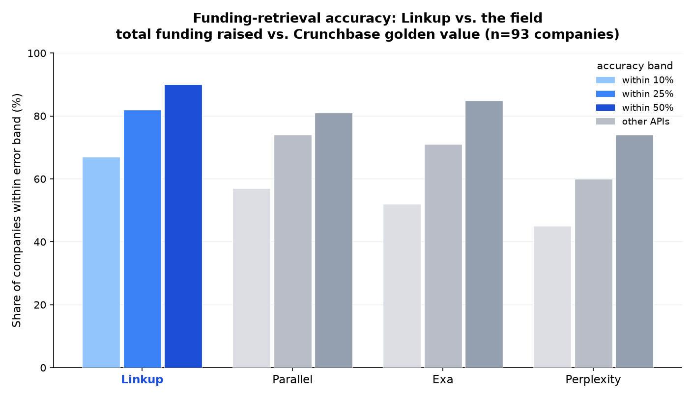

# Funding-retrieval benchmark

**Question:** given only a company's identity (name + HQ + founding year), how
accurately can a search API return its **total funding raised**?

Four APIs — **Linkup, Exa, Perplexity, Parallel** — get the same query and a shared
structured-output schema, and must return a single number. Each answer is scored
against a Crunchbase golden value.

## How it's run

- **Set:** 100 venture-backed companies (`data/golden_set.csv`), drawn from a larger
  1,453-company run. Ground truth = Crunchbase `Total Equity Funding Amount (in USD)`.
- **Query** (identical to every API, filled per company):

  ```
  {name} - headquartered in {hq}, founded {founded}. Find this company's total
  funding raised to date (sum of all rounds) and its latest known valuation,
  with a source.
  ```

- **Structured output:** every API returns the same schema
  (`funding_schema.json`) via its native structured mode; we read
  `total_funding_raised_musd`.

  | API | Endpoint | Key params |
  |---|---|---|
  | Linkup | `POST /v1/search` | `depth=standard`, `outputType=structured` |
  | Exa | `POST /search` | `type=auto`, `numResults=10`, `outputSchema` |
  | Perplexity | `POST /chat/completions` | `model=sonar`, `response_format=json_schema` |
  | Parallel | `POST /v1/tasks/runs` (poll) | `processor=lite-fast`, `task_spec.output_schema` |

- **Scoring:** `error = |api − golden| / golden`; report the share within ±10/25/50%,
  plus median error and coverage. Scored on the **93** companies where Linkup
  returned a number (Linkup-blanks cut) so all four are compared on the same rows.

## Results



| API | within 10% | within 25% | within 50% | median err | coverage |
|---|---|---|---|---|---|
| **Linkup** | **67%** | **82%** | **90%** | **2%** | 100% |
| Parallel | 57% | 74% | 81% | 6% | 100% |
| Exa | 52% | 71% | 85% | 10% | 100% |
| Perplexity | 45% | 60% | 74% | 15% | 94% |

*n = 93. Numbers are the published run (`results/scorecard.csv`).*

**Takeaways**
- On this set Linkup leads every band and has the lowest median error (2%).
- Exa has the strongest tail (85% within 50%) but a wider median (10%) — it rarely
  blanks but often lands in the right ballpark rather than on the number.
- Perplexity is the most volatile (15% median, several `$0` answers) and the only
  engine that left rows blank.
- **Caveat:** search results are non-deterministic, so treat this as a directional
  read on this slice, not a universal leaderboard.

## Full per-company results

All 100 companies with the golden value and each API's returned number, also in
[`data/golden_set.csv`](data/golden_set.csv). `—` = the API returned no number.

<details>
<summary>Show all 100 companies</summary>

| # | Company | HQ | Founded | Golden | Linkup | Exa | Perplexity | Parallel |
|---|---|---|---|---|---|---|---|---|
| 1 | Altano Energy | Madrid, Madrid, Spain | 2021 | **$71M** | $70M | $153M | $60M | $261M |
| 2 | Apricus Generation | Boca Raton, Florida, United States | 2023 | **$28M** | $28M | $130M | $130M | $1.13B |
| 3 | Aradigm Health | Bethesda, Maryland, United States | 2024 | **$20M** | — | $25M | $25M | $20M |
| 4 | Aurascape | Santa Clara, California, United States | 2024 | **$63M** | $63M | $89M | $0M | $50M |
| 5 | Ayan | London, England, United Kingdom | 2023 | **$4M** | $29M | $39M | $7M | $36M |
| 6 | BackOps AI | San Francisco, California, United States | 2024 | **$37M** | $36M | $36M | $34M | $34M |
| 7 | Basis | New York, New York, United States | 2023 | **$138M** | $138M | $138M | $138M | $196M |
| 8 | Baya Systems | Santa Clara, California, United States | 2023 | **$36M** | $36M | $47M | $36M | $47M |
| 9 | BlackWall | Tallinn, Harjumaa, Estonia | 2019 | **$63M** | $63M | $63M | $57M | $63M |
| 10 | Brandlight | New York, New York, United States | 2024 | **$36M** | $36M | $36M | $36M | $36M |
| 11 | Bridgetown Research | Seattle, Washington, United States | 2023 | **$19M** | $19M | $24M | $38M | $19M |
| 12 | C1 Green Chemicals | Berlin, Berlin, Germany | 2022 | **$22M** | $26M | $27M | $28M | $28M |
| 13 | Cartesia | San Francisco, California, United States | 2023 | **$91M** | $191M | $191M | $100M | $191M |
| 14 | Chariot Defense | South San Francisco, California, United States | 2024 | **$42M** | $42M | $42M | $41M | $41M |
| 15 | Circuit | Austin, Texas, United States | 2024 | **$30M** | $45M | $70M | $30M | $30M |
| 16 | Console | San Francisco, California, United States | 2024 | **$29M** | $29M | $30M | $29M | $29M |
| 17 | Corintis | Lausanne, Vaud, Switzerland | 2022 | **$53M** | $53M | $58M | $58M | $58M |
| 18 | Cosmon | San Francisco, California, United States | 2025 | **$31M** | $31M | $31M | $31M | $31M |
| 19 | Curbline Properties | New York, New York, United States | 2023 | **$204M** | — | $955M | $150M | $150M |
| 20 | Daisy | Costa Mesa, California, United States | 2023 | **$33M** | $42M | $35M | $35M | $35M |
| 21 | Datacurve | San Francisco, California, United States | 2024 | **$18M** | $18M | $18M | $18M | $18M |
| 22 | DeepUll | Barcelona, Catalonia, Spain | 2019 | **$92M** | $113M | $113M | $113M | $99M |
| 23 | Dify.AI | Sunnyvale, California, United States | 2023 | **$38M** | $38M | $42M | $38M | $38M |
| 24 | Edurino | Munich, Bayern, Germany | 2021 | **$34M** | $38M | $41M | $28M | $38M |
| 25 | Eranovum | Madrid, Madrid, Spain | 2019 | **$28M** | $28M | $36M | $138700.00B | $139M |
| 26 | Eridu | Saratoga, California, United States | 2024 | **$200M** | $230M | $230M | $200M | $230M |
| 27 | Ethos | London, England, United Kingdom | 2024 | **$26M** | — | $30M | $46M | $414M |
| 28 | FYLD | London, England, United Kingdom | 2020 | **$88M** | $88M | $79M | $80M | $143M |
| 29 | Fable | San Francisco, California, United States | 2024 | **$31M** | $86M | $12M | $31M | $31M |
| 30 | Finary | Paris, Ile-de-France, France | 2020 | **$44M** | $45M | $45M | $42M | $48M |
| 31 | Flink | Berlin, Berlin, Germany | 2020 | **$1.50B** | $1.43B | $1.53B | $1.53B | $1.57B |
| 32 | Fortuna Health | New York, New York, United States | 2023 | **$22M** | $22M | $22M | $22M | $22M |
| 33 | Fractile | London, England, United Kingdom | 2022 | **$257M** | $258M | $266M | $0M | $266M |
| 34 | Frontera Health | Denver, Colorado, United States | 2023 | **$32M** | $42M | $42M | $32M | $42M |
| 35 | Genomines | Paris, Ile-de-France, France | 2021 | **$50M** | $62M | $62M | $50M | $50M |
| 36 | Grand Slam Track | Playa Del Rey, California, United States | 2024 | **$30M** | $30M | $30M | $18M | $13M |
| 37 | GravitHy | Marseille, Provence-Alpes-Cote d'Azur, France | 2022 | **$64M** | $64M | $65M | $64M | $65M |
| 38 | Gray Swan | Pittsburgh, Pennsylvania, United States | 2023 | **$40M** | $40M | $40M | $50M | $50M |
| 39 | HavocAI | Providence, Rhode Island, United States | 2024 | **$197M** | $100M | $285M | $100M | $197M |
| 40 | Heat2Power | Ann Arbor, Michigan, United States | 2024 | **$18M** | $18M | $15M | $3M | $15M |
| 41 | HolaCamp | Barcelona, Catalonia, Spain | 2023 | **$11M** | $11M | $33M | — | $35M |
| 42 | Holyvolt | Stockholm, Stockholms Lan, Sweden | 2022 | **$35M** | $42M | $25M | $18M | $42M |
| 43 | Inversion | New York, New York, United States | 2024 | **$26M** | $26M | $26M | $81M | $54M |
| 44 | JAAQ | London, England, United Kingdom | 2021 | **$17M** | $17M | $17M | $34M | $17M |
| 45 | LIS Technologies | New York, New York, United States | 2023 | **$71M** | $65M | $72M | $64M | $72M |
| 46 | Lettuce Financial | San Francisco, California, United States | 2023 | **$58M** | $52M | $49M | $46M | $52M |
| 47 | Luel | San Francisco, California, United States | 2025 | **$32M** | $32M | $31M | $31M | $32M |
| 48 | MagREEsource | Grenoble, Rhone-Alpes, France | 2020 | **$32M** | $32M | $55M | $0M | $32M |
| 49 | MainFunc | Palo Alto, California, United States | 2023 | **$554M** | $275M | $625M | $160M | $625M |
| 50 | Maki | Paris, Ile-de-France, France | 2021 | **$39M** | $35M | $35M | $29M | $39M |
| 51 | Mercanis | Berlin, Berlin, Germany | 2020 | **$30M** | $30M | $30M | $30M | $30M |
| 52 | MintNeuro | London, England, United Kingdom | 2022 | **$1M** | — | $22M | — | $3M |
| 53 | Monarch Quantum | San Diego, California, United States | 2025 | **$55M** | $76M | $76M | $0M | $115M |
| 54 | Multifactor | San Francisco, California, United States | 2025 | **$15M** | $15M | $15M | $0M | $16M |
| 55 | Multiverse Computing | Donostia-san Sebastián, Pais Vasco, Spain | 2019 | **$342M** | $359M | $351M | $219M | $359M |
| 56 | NORNORM | Copenhagen, Hovedstaden, Denmark | 2020 | **$116M** | $118M | $174M | $160M | $118M |
| 57 | Naboo | Paris, Ile-de-France, France | 2021 | **$101M** | $99M | $102M | $107M | $107M |
| 58 | Nelly | Berlin, Berlin, Germany | 2021 | **$72M** | $72M | $287M | $50M | $181M |
| 59 | Neumirna Therapeutics | Copenhagen, Hovedstaden, Denmark | 2020 | **$21M** | $26M | $24M | $24M | $21M |
| 60 | Nominal | New York, New York, United States | 2023 | **$29M** | $182M | $155M | — | $182M |
| 61 | Northwood Space | Torrance, California, United States | 2023 | **$161M** | $142M | $136M | $137M | $136M |
| 62 | NuCube Energy | Idaho Falls, Idaho, United States | 2023 | **$16M** | $13M | $16M | $13M | $13M |
| 63 | Pace | New York, New York, United States | 2024 | **$56M** | $56M | $65M | $84M | $56M |
| 64 | Pelico | Paris, Ile-de-France, France | 2019 | **$72M** | $63M | $72M | $72M | $72M |
| 65 | Phagos | Paris, Ile-de-France, France | 2021 | **$32M** | $32M | $35M | $27M | $25M |
| 66 | Pinnacle Medicines | Doylestown, Pennsylvania, United States | 2024 | **$90M** | $134M | $134M | $134M | $134M |
| 67 | Presto | Oakland, California, United States | 2023 | **$15M** | $15M | $15M | $124M | $190M |
| 68 | Prime Intellect | San Francisco, California, United States | 2024 | **$70M** | $70M | $70M | $0M | $70M |
| 69 | Promptfoo | San Francisco, California, United States | 2024 | **$23M** | $23M | $23M | $23M | $23M |
| 70 | Quantix EdgeS | Murcia, Murcia, Spain | 2024 | **$23M** | $22M | $20M | $21M | $21900.00B |
| 71 | RIFT | Eindhoven, Noord-Brabant, The Netherlands | 2020 | **$111M** | $138M | $146M | $0M | $132M |
| 72 | Remittix | New York, New York, United States | 2024 | **$28M** | $30M | $68M | $30M | $30M |
| 73 | Rerun | Stockholm, Stockholms Lan, Sweden | 2022 | **$20M** | $20M | $20M | $20M | $20M |
| 74 | RevEng | London, England, United Kingdom | 2022 | **$19M** | $20M | $21M | $0M | $20M |
| 75 | Rivan Industries | Lewisham, Lewisham, United Kingdom | 2022 | **$47M** | $48M | $47M | $46M | $46M |
| 76 | SWEBAL | Stockholm, Stockholms Lan, Sweden | 2024 | **$39M** | $35M | $35M | $34M | $33M |
| 77 | SafetyKit | San Francisco, California, United States | 2023 | **$32M** | $27M | $30M | $27M | $27M |
| 78 | Salient | San Francisco, California, United States | 2023 | **$60M** | $60M | $60M | $70M | $60M |
| 79 | Saltz | Vilnius, Vilniaus Apskritis, Lithuania | 2022 | **$26M** | $26M | $26M | — | $27M |
| 80 | Saturn AI | London, England, United Kingdom | 2023 | **$18M** | $18M | $15M | $0M | $15M |
| 81 | Seedli Capital | Flushing, New York, United States | 2025 | **$20M** | $20M | $20M | $20M | $20M |
| 82 | Sifflet | Paris, Ile-de-France, France | 2021 | **$36M** | $18M | $36M | $18M | $54M |
| 83 | Silverflow | Amsterdam, Noord-Holland, The Netherlands | 2019 | **$76M** | $76M | $77M | $0M | $76M |
| 84 | Slate Medicines | Raleigh, North Carolina, United States | 2025 | **$130M** | $130M | $130M | — | $130M |
| 85 | Sparta | Geneva, Geneve, Switzerland | 2020 | **$66M** | $120M | $72M | $26M | $48M |
| 86 | Spiral | New York, New York, United States | 2023 | **$22M** | — | $43M | — | $42M |
| 87 | Starbridge | New York, New York, United States | 2023 | **$52M** | $52M | $54M | $52M | $52M |
| 88 | Steady Energy | Helsinki, Southern Finland, Finland | 2023 | **$48M** | $74M | $53M | $50M | $74M |
| 89 | Subbyx | Milan, Lombardia, Italy | 2023 | **$56M** | $62M | $63M | $35M | $54M |
| 90 | TRIVER | London, England, United Kingdom | 2022 | **$28M** | $31M | $143M | — | $31M |
| 91 | The Icon League | Cologne, Nordrhein-Westfalen, Germany | 2023 | **$17M** | $15M | $15M | $17M | $17M |
| 92 | Tytan Technologies | Munich, Bayern, Germany | 2023 | **$52M** | $54M | $46M | — | $50M |
| 93 | Upway | Gennevilliers, Ile-de-France, France | 2021 | **$121M** | $125M | $125M | $120M | $125M |
| 94 | Variance | San Francisco, California, United States | 2023 | **$25M** | $26M | $27M | $26M | $27M |
| 95 | Ventaris Surgical | San Carlos, California, United States | 2024 | **$31M** | $31M | $30M | $30M | $30M |
| 96 | Via Sana | Paris, Ile-de-France, France | 2020 | **$25M** | $6M | $18M | $0M | $6M |
| 97 | Vivici | Delft, Zuid-Holland, The Netherlands | 2022 | **$34M** | $34M | $49M | $46M | $34M |
| 98 | Vultron | San Francisco, California, United States | 2024 | **$27M** | — | $27M | $27M | $22M |
| 99 | Warp | New York, New York, United States | 2023 | **$24M** | $73M | $73M | $88M | $75M |
| 100 | terralayr | Zug, Zug, Switzerland | 2022 | **$219M** | — | $404M | $223M | $404M |

</details>

## Reproduce

```bash
# from repo root
python3 -m venv .venv && source .venv/bin/activate
pip install -r requirements.txt
cd funding-retrieval
cp .env.example .env        # paste LINKUP/EXA/PERPLEXITY/PARALLEL keys

# 1. query all four APIs (each writes results/raw/<provider>.csv)
S=scripts
python3 $S/run_search.py --provider linkup     --endpoint search --queries data/queries.txt \
  --params '{"depth":"standard"}'              --schema funding_schema.json --out results/raw &
python3 $S/run_search.py --provider exa        --endpoint search --queries data/queries.txt \
  --params '{"type":"auto","numResults":10}'   --schema funding_schema.json --out results/raw &
python3 $S/run_search.py --provider perplexity --endpoint chat   --queries data/queries.txt \
  --params '{"model":"sonar"}'                 --schema funding_schema.json --out results/raw &
python3 $S/run_search.py --provider parallel   --endpoint task   --queries data/queries.txt \
  --params '{"processor":"lite-fast"}'         --schema funding_schema.json --out results/raw &
wait
python3 $S/merge_results.py --dir results/raw --out results/query_results.csv

# 2. score + plot. score.py recomputes from the committed golden_set.csv;
#    plot_results.py renders the official scorecard.csv into scorecard.png
python3 $S/score.py
python3 $S/plot_results.py
```

Re-scoring the committed `data/golden_set.csv` with `score.py` reproduces the
published card within a few points — the public table rounds funding to whole `$M`,
while the official card was scored on the raw API floats. To regenerate the dataset
from a fresh live run, extract `total_funding_raised_musd` from
`results/query_results.csv` into the `golden_set.csv` columns.

## Files

```
funding-retrieval/
├── data/
│   ├── golden_set.csv     # 100 companies: golden value + each API's answer
│   └── queries.txt        # the 100 verbatim queries
├── funding_schema.json    # structured-output schema sent to every API
├── scripts/
│   ├── run_search.py      # query one provider/endpoint, structured, rate-limited
│   ├── merge_results.py   # combine per-provider partials into one CSV
│   ├── score.py           # golden_set.csv -> accuracy bands + median error
│   └── plot_results.py    # scorecard.csv -> scorecard.png
└── results/
    ├── scorecard.csv      # official published result
    └── scorecard.png      # the graph above
```
